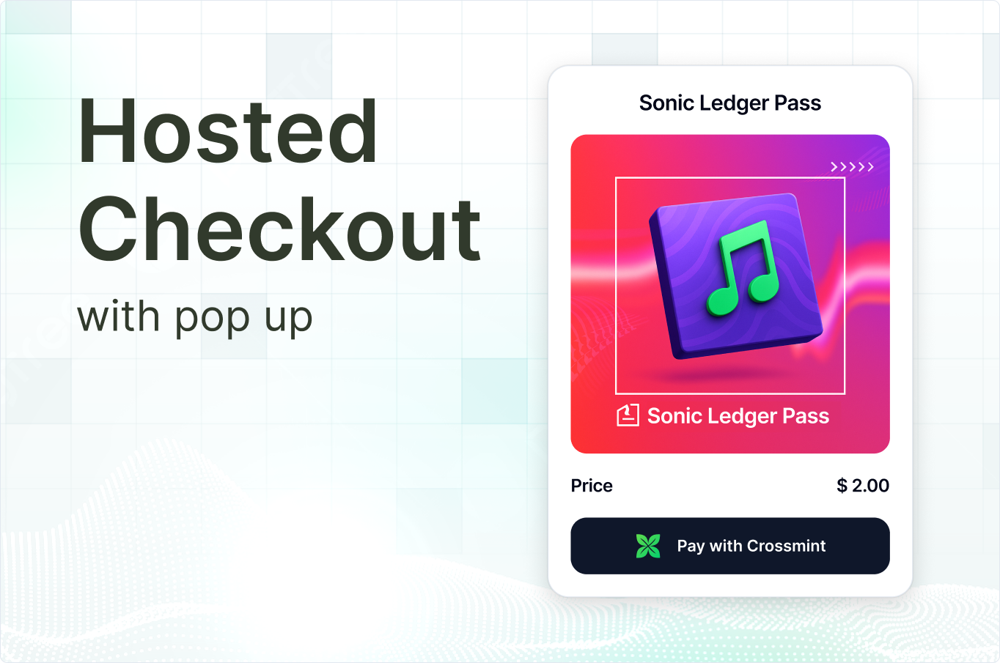

<div align="center">

<br>
<br>
<h1>Hosted Checkout Quickstart</h1>

<div align="center">
<a href="https://hosted-checkout.demos-crossmint.com/">Live Demo</a> | <a href="https://docs.crossmint.com/payments/pay-button/overview">Docs</a> | <a href="https://github.com/crossmint">See all quickstarts</a>
</div>

<br>
<br>

</div>

## Introduction

Allow your customers to buy NFTs with credit card and crypto payments, using Crossmint's hosted checkout. This quickstart provides a seamless integration for accepting payments in your dApp.

**Key features:**

- Accept fiat payments via credit, debit card, Apple Pay and Google Pay
- Accept crypto payments
- Deliver NFTs directly to a buyer's wallet or email address

### Prerequisites

- Create a developer account in the [Staging Console](https://staging.crossmint.com/signin?callbackUrl=/console).
- Create a [client-side API key](https://docs.crossmint.com/introduction/platform/api-keys/client-side) with the following scope: `orders.create`.
- Create a [new collection](https://docs.crossmint.com/payments/guides/create-collection) or [import yours](https://docs.crossmint.com/payments/guides/register-collection) in the console, and have your `collectionId` ready.
- Make sure your collection has at least one NFT configured
- From the detail view of your collection, navigate to the Checkout tab to configure the pricing settings and enable Credit Card and Crypto payments.

## Deploy

Easily deploy the template to Vercel with the button below. You will need to set the required environment variables in the Vercel dashboard.

[](https://vercel.com/new/clone?repository-url=https%3A%2F%2Fgithub.com%2FCrossmint%2Fhosted-checkout-quickstart&env=NEXT_PUBLIC_CROSSMINT_API_KEY&env=NEXT_PUBLIC_CROSSMINT_COLLECTION_ID)

## Setup

1. Clone the repository and navigate to the project folder:

    ```bash
    git clone https://github.com/crossmint/hosted-checkout-quickstart.git && cd hosted-checkout-quickstart
    ```

2. Install all dependencies:

    ```bash
    npm install
    # or
    yarn install
    # or
    pnpm install
    # or
    bun install
    ```

3. Set up the environment variables by copying the template file:

    ```bash
    cp .env.template .env
    ```

4. Add your Crossmint `collectionId` to the `.env` file.

    ```bash
    NEXT_PUBLIC_CROSSMINT_COLLECTION_ID=your_collection_id
    ```

5. Get your client-side API key from the [Crossmint Console Overview](https://staging.crossmint.com/console/overview) and add it to the `.env` file.

    ```bash
    NEXT_PUBLIC_CROSSMINT_API_KEY=your_api_key
    ```

6. Run the development server:

    ```bash
    npm run dev
    # or
    yarn dev
    # or
    pnpm dev
    # or
    bun dev
    ```

## Using in production

1. Create an account in the [Production Console](https://www.crossmint.com/signin?callbackUrl=/console), add your collection and configure the payment settings from the Checkout tab.
2. Verify your account as the project owner and verify your collection. [Learn more](https://docs.crossmint.com/introduction/platform/account-verification) about verifications.
3. Create a [production client-side API key](https://docs.crossmint.com/introduction/platform/api-keys/client-side) with the following scope: `orders.create`.
4. Update your `.env` file with your production variables.
5. Deploy your application to a production environment.

## Advanced Usage

For advanced usage, refer to the Crossmint documentation:

- Customize the UI: [https://docs.crossmint.com/payments/pay-button/guides/ui-customization](https://docs.crossmint.com/payments/pay-button/guides/ui-customization)
- Edit payment methods: [https://docs.crossmint.com/payments/pay-button/guides/payment-methods](https://docs.crossmint.com/payments/pay-button/guides/payment-methods)